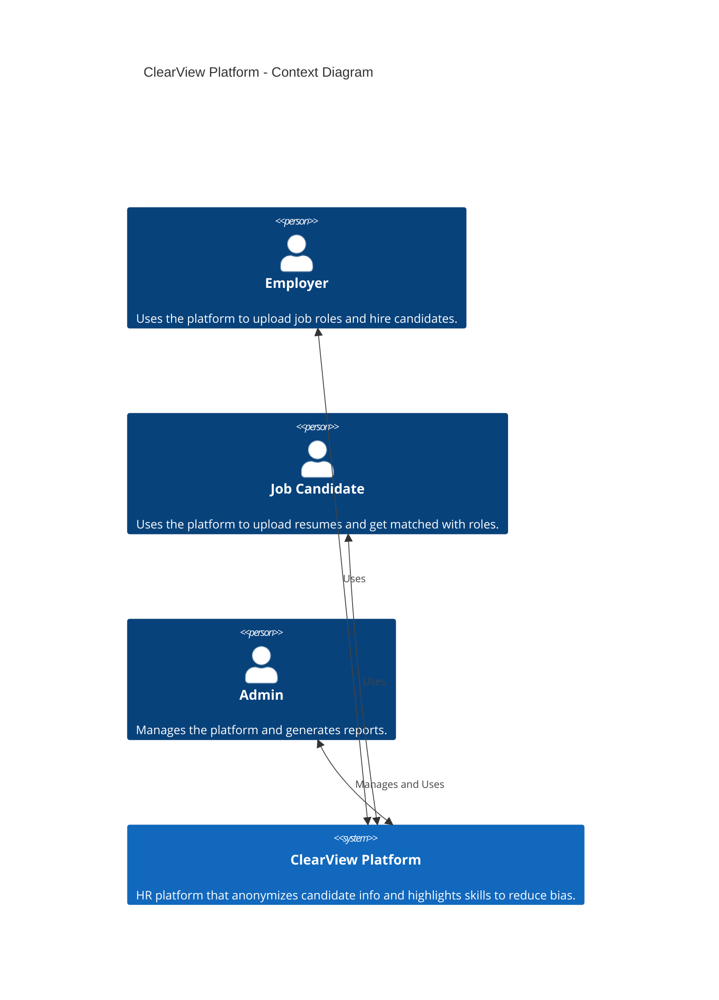
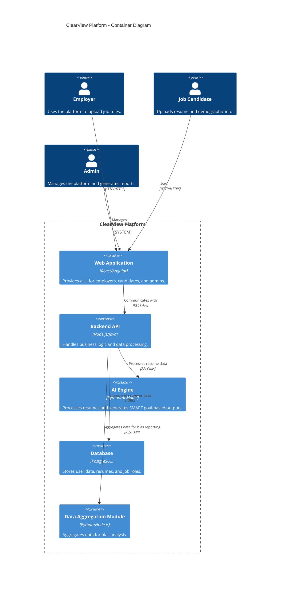
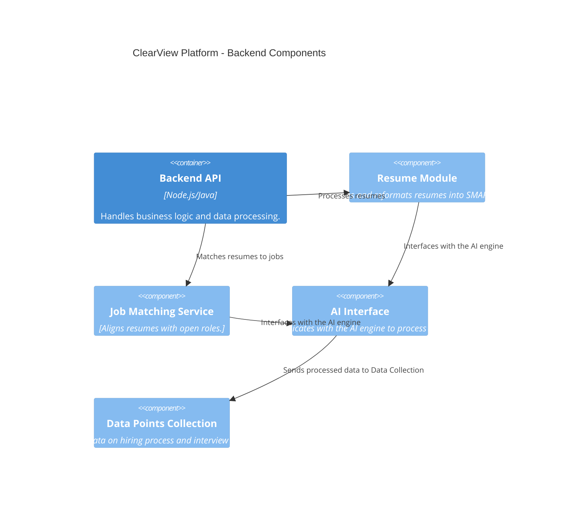

# Readme

Here is a demo c4 diagram:

## Context

```mermaid
C4Context
    title ClearView Platform - Context Diagram

    Person(employer, "Employer", "Uses the platform to upload job roles and hire candidates.")
    Person(job_candidate, "Job Candidate", "Uses the platform to upload resumes and get matched with roles.")
    Person(admin, "Admin", "Manages the platform and generates reports.")
    
    System(clearview, "ClearView Platform", "HR platform that anonymizes candidate info and highlights skills to reduce bias.")
    
    BiRel(employer, clearview, "Uses")
    BiRel(job_candidate, clearview, "Uses")
    BiRel(admin, clearview, "Manages and Uses")

```

## Container

```mermaid
C4Container
    title ClearView Platform - Container Diagram

    Person(employer, "Employer", "Uses the platform to upload job roles.")
    Person(job_candidate, "Job Candidate", "Uploads resume and demographic info.")
    Person(admin, "Admin", "Manages the platform and generates reports.")
    
    System_Boundary(clearview, "ClearView Platform") {
        Container(webapp, "Web Application", "React/Angular", "Provides a UI for employers, candidates, and admins.")
        Container(backend, "Backend API", "Node.js/Java", "Handles business logic and data processing.")
        Container(ai_engine, "AI Engine", "Python/AI Model", "Processes resumes and generates SMART goal-based outputs.")
        Container(database, "Database", "PostgreSQL", "Stores user data, resumes, and job roles.")
        Container(data_agg, "Data Aggregation Module", "Python/Node.js", "Aggregates data for bias analysis.")
    }

    Rel(employer, webapp, "Uses", "HTTP/HTTPS")
    Rel(job_candidate, webapp, "Uses", "HTTP/HTTPS")
    Rel(admin, webapp, "Manages", "HTTP/HTTPS")
    
    Rel(webapp, backend, "Communicates with", "REST API")
    Rel(backend, ai_engine, "Processes resume data", "API Calls")
    Rel(backend, database, "Stores and retrieves data", "JDBC")
    Rel(backend, data_agg, "Aggregates data for bias reporting", "REST API")

```

## Component

```mermaid
C4Component
    title ClearView Platform - Backend Components

    Container(backend, "Backend API", "Node.js/Java", "Handles business logic and data processing.")
    
    Component(resume_mod, "Resume Module", "Processes and reformats resumes into SMART goals.")
    Component(job_match, "Job Matching Service", "Aligns resumes with open roles.")
    Component(ai_int, "AI Interface", "Communicates with the AI engine to process resumes.")
    Component(data_coll, "Data Points Collection", "Collects data on hiring process and interview feedback.")
    
    Rel(backend, resume_mod, "Processes resumes")
    Rel(backend, job_match, "Matches resumes to jobs")
    Rel(resume_mod, ai_int, "Interfaces with the AI engine")
    Rel(job_match, ai_int, "Interfaces with the AI engine")
    Rel(ai_int, data_coll, "Sends processed data to Data Collection")


```

